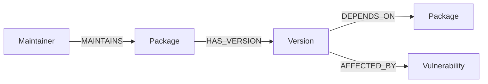

# Graph-Database-Application
## DepTrust — Open Source Dependency & Maintainer Risk Graph

DepTrust maps the open-source software supply chain — packages, versions, maintainers,
and vulnerabilities — as a graph, so you can see risk that a flat package list hides:
packages kept alive by a single maintainer, how far a compromise would spread ("blast
radius"), and how deep the dependency rabbit hole goes.

Built on **CognoDB** (openCypher over Bolt), accessed through the official `neo4j-driver`.

## Why a graph database?

The two things this app needs to answer well are inherently path questions:

- *"If package X is compromised, what's affected?"* — this is a **variable-length
  traversal** through an unknown number of dependency hops. In a relational schema this
  is a self-join on a `dependencies` table repeated N times, or a recursive CTE that gets
  slow and awkward past a few levels. In Cypher it's one pattern:
  `(dependent)-[:DEPENDS_ON*1..4]->(target)`.
- *"Which single-maintainer packages matter most?"* combines a **graph-shape condition**
  (exactly one `MAINTAINS` edge) with a **transitive reachability count** — two different
  kinds of graph reasoning composed in one query. Expressing that in SQL means multiple
  subqueries and recursive joins layered together.

A graph database doesn't just make these queries shorter — it makes "how far, through
how many hops, along which path" a first-class, indexable concept instead of something
the application layer has to reconstruct.

## Data model



- **Package** `{name, ecosystem, description, latest_version, weekly_downloads}`
- **Version** `{version_number, release_date, deprecated}`
- **Maintainer** `{username, email_domain}` — edge `MAINTAINS {since}`
- **Vulnerability** `{cve_id, severity, published_date}`
- **DEPENDS_ON** `{version_range}` — the core multi-hop edge, `Version → Package`

Seed data forms a layered DAG (6 layers deep) so dependency chains and blast-radius
queries have realistic, bounded depth. ~320 packages, ~140 maintainers, ~30% of packages
seeded with exactly one maintainer to demonstrate bus-factor risk.

## Project structure

```
deptrust/
  backend/
    server.js      # Express app, API routes, graceful DB-down handling
    db.js           # neo4j-driver connection + parameterised query runner
    queries.js       # every Cypher query used by the app, in one place
    seed.js          # generates and loads the graph via batched, parameterised Cypher
    .env.example
  frontend/
    index.html, style.css, app.js   # vanilla JS SPA, served statically by Express
```

## Setup

### 1. Create your CognoDB instance
1. Sign up at https://console.cognodb.com/signup (free, no card required).
2. Create a free (c0) instance, pick a region — ready in under a minute.
3. Copy the connection URI and the `cognodb` user's password (shown once).

### 2. Configure and install
```bash
cd backend
cp .env.example .env
# edit .env with your COGNODB_URI / COGNODB_USER / COGNODB_PASSWORD
npm install
```

### 3. Seed the graph
```bash
npm run seed
```

### 4. Run
```bash
npm start
# open http://localhost:3000
```

If CognoDB is unreachable, the UI still loads and shows a clear error state per panel
instead of crashing — try stopping your instance to see this in action.

## Main queries, explained

| Query | What it answers | Why it's graph-native |
|---|---|---|
| `busFactorRisk` | Single-maintainer packages ranked by how many packages transitively depend on them | Variable-length reachability count |
| `blastRadius(name)` | Everything that transitively depends on a package, with shortest-path hop distance | Variable-length shortest path |
| `deepestChains` | The longest dependency chain in the graph | Longest-path traversal |
| `sharedRiskClusters` | Packages that share a maintainer with a vulnerable package | Two-hop shared-identity join |
| `orphanRisk(username)` | Packages left with zero maintainers if one maintainer left | Conditional multi-hop aggregation |

All queries are parameterised through the official Neo4j driver — see `queries.js`.

## UI

- **Risk Dashboard** — bus-factor leaderboard, deepest chains, shared-maintainer risk,
  most-active maintainers, each with its own loading/empty/error state.
- **Explore Packages** — live search over the graph.
- **Package detail** — stats, maintainers, direct deps/dependents, and the **blast-radius
  radar**: a concentric-ring visualization where the target package sits at the center
  and every transitive dependent is placed on the ring matching its hop distance,
  color-coded from urgent (near) to minor (far).

